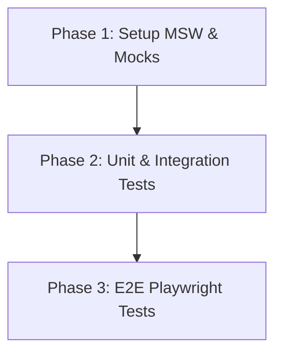

# Phase 4 Validation Implementation Plan

## Plan Overview
- **Total Phases**: 3
- **Agents Involved**: `tester`
- **Estimated Effort**: Medium

## Dependency Graph

## Execution Strategy

| Stage | Phase | Agent | Mode |
|---|---|---|---|
| Foundation | 1. Setup MSW & Mocks | `tester` | Sequential |
| Core Testing | 2. Unit & Integration Tests | `tester` | Sequential |
| E2E Testing | 3. E2E Playwright Tests | `tester` | Sequential |

## Phase Details

### Phase 1: Setup MSW & Mocks
**Objective**: Establish the MSW testing infrastructure for intercepting OpenAI calls and seed mock data for PostGIS testing.
**Agent**: `tester`
**Files to Create**:
- `src/__tests__/mocks/handlers.ts`: Define MSW request handlers for `https://api.openai.com/v1/chat/completions`.
- `src/__tests__/mocks/server.ts`: Setup MSW node server.
- `src/__tests__/fixtures/llm-responses.json`: Store realistic OpenAI JSON payloads.
**Validation**: Run a basic test ensuring the MSW server initializes without errors.
**Dependencies**: None.

### Phase 2: Unit & Integration Tests
**Objective**: Implement tests for AI Liaison, LangGraph Negotiator, and the Maximizer tour optimizer using the MSW setup.
**Agent**: `tester`
**Files to Modify/Create**:
- `src/__tests__/unit/ai/liaison.test.ts` (Modify/Create): Test prompt generation and response parsing.
- `src/__tests__/unit/ai/negotiation.test.ts` (Modify/Create): Test state transitions in `graph.ts`.
- `src/__tests__/unit/ai/maximizer.test.ts` (Create): Test geographic querying and prioritization logic.
**Validation**: Run `npx vitest run src/__tests__/unit/ai/` and ensure all tests pass.
**Dependencies**: `blocked_by`: [1]

### Phase 3: E2E Playwright Tests
**Objective**: Implement E2E tests validating the user flow from the Swipe-to-Book UI through to the AI negotiation completion.
**Agent**: `tester`
**Files to Create/Modify**:
- `src/__tests__/e2e/negotiation-flow.spec.ts`: Playwright test simulating the venue swipe, offer creation, and contract generation, using `page.route` to mock the AI API response.
**Validation**: Run `npx playwright test src/__tests__/e2e/negotiation-flow.spec.ts` and ensure it passes.
**Dependencies**: `blocked_by`: [2]

## Cost Estimation

| Phase | Agent | Model | Est. Input | Est. Output | Est. Cost |
|-------|-------|-------|-----------|------------|----------|
| 1 | tester | gemini-2.5-flash | 2000 | 500 | $0.004 |
| 2 | tester | gemini-2.5-flash | 4000 | 1000 | $0.008 |
| 3 | tester | gemini-2.5-flash | 4000 | 1000 | $0.008 |
| **Total** | | | **10000** | **2500** | **$0.020** |

## Execution Profile
- Total phases: 3
- Parallelizable phases: 0
- Sequential-only phases: 3
- Estimated sequential wall time: 10 minutes
